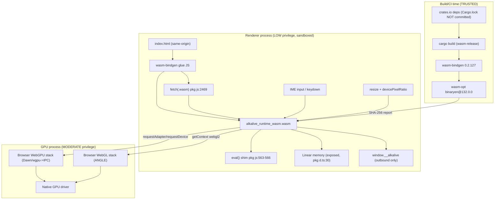

# AlkALive Security Analysis — Wave 0: Attack Surface Map & STRIDE Threat Model

- **Wave:** 0
- **Status:** COMPLETE — DoD PASSED
- **Scope:** `deploy/` static site + WASM runtime + WebGPU (primary) / WebGL2 (fallback) renderers + build/CI pipeline
- **Method:** evidence-based inventory (every claim cited as `file:line` at HEAD `2352b77`); external research verified against NVD / cve.org / vendor bulletins / peer-reviewed papers. No assumptions of safety; absence of a risk is justified, never assumed.

---

## 1. System context

AlkALive ships as a **fully client-side static site**:

```
Browser (renderer process, sandboxed)
 └─ index.html ── module script
     └─ wasm-bindgen glue (deploy/pkg/alkalive_runtime_wasm.js)
         └─ WASM module (deploy/pkg/alkalive_runtime_wasm_bg.wasm)
             ├─ embedded hello.alk scene (compile at boot)
             ├─ embedded Roboto-Regular.ttf (include_bytes!)
             ├─ WebGPU renderer (wgpu 24, conservative limits)  ── primary
             └─ WebGL2 renderer (web-sys, GLSL ES 300)          ── fallback
Server: deploy/serve.mjs (dev, 127.0.0.1) or any static host
```

There is **no server-side application code, no user accounts, no network API** in the
deployed product (verified: grep for `fetch`/`XMLHttpRequest`/`localStorage` across
the runtime shows only the glue's same-origin `.wasm` fetch, `pkg/*.js:2469`).
The CLI compiler (`crates/alkalive-compiler/src/main.rs`) is a host-side tool and is
**not** part of the browser artifact.

## 2. Attack surface diagram



Trust boundaries crossed: (1) **network→renderer** (wasm fetch, no integrity check),
(2) **renderer→GPU process** (WebGPU/WebGL IPC — browser-owned), (3) **crates.io→build**
(dependency resolution; `Cargo.lock` gitignored), (4) **user input→runtime** (keyboard/IME).

## 3. Sub-Task 0.1 — Entry points inventory

Complete list (repo-wide greps; single `#[wasm_bindgen]` export in the entire codebase):

| # | Entry point | Evidence | Notes |
|---|---|---|---|
| E1 | `start(canvas, ime)` — the **only** WASM export | `crates/alkalive-runtime-wasm/src/lib.rs:378-382` | Installs panic hook, checks `crossOriginIsolated`, compiles embedded scene, spawns frame loop |
| E2 | Module load `init('./pkg/...wasm')` | `deploy/index.html:22`; glue fetch `deploy/pkg/alkalive_runtime_wasm.js:2469` | Same-origin fetch, **no integrity check** on bytes |
| E3 | `eval()` shim in glue | glue `:563-566`, fed by `js_sys::eval` calls `runtime-wasm/src/lib.rs:392,449` | Constant strings only today; live code-exec sink |
| E4 | `keydown` listener | `runtime-wasm/src/lib.rs:798-844` | Printable chars/Backspace/Enter/Escape into `input_text` |
| E5 | IME `input` listener | `runtime-wasm/src/lib.rs:852-867` | `e.data()` appended verbatim, no cap at this layer |
| E6 | `click` listener (focus hit-test) | `runtime-wasm/src/lib.rs:934-964` | CPU bounding-box only |
| E7 | `resize` listener | `runtime-wasm/src/lib.rs:879-925` | w×dpr, `.max(1.0)`, **no upper bound** (u32::MAX passthrough by design, test `backend lib.rs:1717`) |
| E8 | WebGPU probe/device request | `crates/alkalive-backend-wgpu/src/wgpu_renderer.rs:628-651,677-717` | 10 s timeout (`:69`), `Features::empty()`, `Limits::downlevel_webgl2_defaults()` |
| E9 | WebGL2 context acquisition | `crates/alkalive-backend-wgpu/src/lib.rs:544-552` | `getContext("webgl2")` + type check; **no context-loss handler** |
| E10 | Shader compilation (8 static sources) | WGSL: `wgpu_renderer.rs:300-309` + `wgsl_shaders.rs:59-197`; GLSL: `backend lib.rs:135-238,1520-1542` | All `const &str`; **zero dynamic construction** |
| E11 | Font bundle `load_bundle` (API surface) | `crates/alkalive-text/src/lib.rs:759-785` | Documented untrusted-input API (SEC-03); unreachable from the deployed page (font is `include_bytes!`, `backend lib.rs:1340`) |
| E12 | Compiler `.alk` input (host CLI only) | `crates/alkalive-compiler/src/main.rs` | Not shipped to browser |
| E13 | serve.mjs HTTP server (dev) | `deploy/serve.mjs:34-63` | 127.0.0.1-bound, COOP/COEP set, path-traversal guard `:45-51`, **no CSP** |
| E14 | CI/build pipeline inputs | `build-deploy.mjs`, `.github/workflows/ci.yml` | crates.io + npm resolution at build time |

## 4. Sub-Task 0.2 — Privilege hierarchy (browser multi-process model)

Modern browsers place web content in a **low-privilege sandboxed renderer process** and
GPU work in a **moderate-privilege GPU process** (see Chromium's WebGPU Technical Report,
"Chrome Graphics as Seen By Attackers", chromium.googlesource.com; and the wgpu project
threat model, gfx-rs/wgpu `SECURITY.md`:

> "WebGPU introduces a different threat model than is sometimes applied to GPU-related
> software. It is generally considered a high-severity vulnerability in wgpu if JavaScript
> or WebAssembly code can escape the applicable sandbox and run arbitrary code or call
> arbitrary system APIs on the user agent host."

Component placement for AlkALive:

| Component | Process | Privilege | Escalation path |
|---|---|---|---|
| index.html JS, glue JS, our WASM, wgpu-in-wasm | Renderer | Low (site-isolation sandbox) | Compromise of renderer → attacks GPU process via IPC (e.g. CVE-2025-12380, CVE-2025-11205) |
| WebGPU command translation (Dawn in Chrome; wgpu-hal→browser in Firefox) | GPU process | Moderate | Driver bugs (CVE-2025-0050/0932) reachable from here |
| ANGLE / native GPU driver | GPU process | Moderate-high (kernel-adjacent) | Kernel escalation out of scope of this repo |
| serve.mjs / build pipeline | Host (build time) | Full (trusted) | Supply-chain: dependency tampering |

**Privilege boundaries relevant to our code:** our WASM never holds elevated rights; the
highest-value in-page sink it can reach is the glue `eval()` (E3) — executing a
non-constant string there would be code execution **in the renderer process**, from which
the cited WebGPU/WebGL IPC attack chain toward the GPU process begins. AlkALive's own
wgpu usage requests **zero optional features** and downlevel-webgl2 limits
(`wgpu_renderer.rs:696-717`), which is the correct posture per the wgpu threat model.

## 5. Sub-Task 0.3 — External data inputs (categorized)

| Input | Origin | Trust | Existing validation | Gaps |
|---|---|---|---|---|
| WASM bytes | same-origin fetch | medium (transport-dependent) | structural validation at build (`build-deploy.mjs:163-175`); **none at load** | no runtime integrity check (SRI-class) |
| Font bytes (API path) | arbitrary caller bytes | **untrusted by design** | 50 MiB cap pre-parse (`text lib.rs:63,764-769`); sfnt parse `:770-773`; contour guard `:1347-1364`; rasterizer rejects `:1208-1230` | relies on upstream read-fonts depth validation |
| User text (IME/keys) | local user, arbitrary Unicode | untrusted content | 1 MiB cap at shape (`text lib.rs:73,904-913`) | no early cap in listener; vertex budget unbounded below 1 MiB (≈96 MB worst case, `wgpu_renderer.rs:936-943`) |
| Shader sources | build-time constants | trusted | naga parse/validate tests `wgsl_shaders.rs:199-297` | none (static) |
| GPU buffer/texture data | derived (glyphs/verts) | derived | atlas page exact-length check `wgpu_renderer.rs:518-523`; slot cap 16 `:861-872`; resize ≥1 clamp `backend lib.rs:317-319` | no upper canvas bound; no device-loss detection |
| Canvas metrics / dpr | browser | trusted | `.max(1.0)` | u32::MAX passthrough → relies on GPU rejection |
| Build deps | crates.io / npm | **transitive trust** | deny.toml advisories/bans (local), CI version pins (bindgen 0.2.127, binaryen 132.0.0) | **Cargo.lock not committed** → per-build resolution drift; no cargo-deny/audit CI gate |

## 6. Sub-Task 0.4 — STRIDE threat model

Severity = likelihood × impact **within this codebase's control**; inherited browser bugs
are tracked separately (Waves 2-3).

| ID | Category | Threat | Evidence / research basis | Severity | Mitigation (owner wave) |
|---|---|---|---|---|---|
| T-S1 | Spoofing | Swapped WASM artifact via MITM/compromised host: fetch has no integrity check | glue `:2469` | Medium | Runtime SHA-256 pin vs `build-report.json` + serve over TLS; verify-at-load (Wave 6) |
| T-S2 | Spoofing | Forged `.alk` scene/font in artifact | embedded via `include_str!/include_bytes!` (`runtime-wasm lib.rs:85`, `backend lib.rs:1340`) | Low | Build-time trust; SHA report gate in CI already (Wave 4 review) |
| T-T1 | Tampering | Dependency drift between builds (Cargo.lock gitignored) | `.gitignore:4`; root `Cargo.toml` caret reqs | **Medium-High** | Commit Cargo.lock + add cargo-deny/audit CI gates (Wave 6) |
| T-T2 | Tampering | Hostile font tables reach deep parsers | `load_bundle` path; prior real panic: non-monotonic `end_pts_of_contours` (fixed 0c5a0f3, guard `text lib.rs:1347-1364`) | Medium (API) / Low (deployed) | Cap+guards exist; harden further in Wave 6 (magic-byte pre-check) |
| T-T3 | Tampering | Shader source injection | impossible today — 8 static consts, users reach only uniforms (Explore §3) | Low | Document invariant + regression test (Wave 7) |
| T-R1 | Repudiation | No audit trail of security events | console-only logging | Low | Client-side single-user app, no transactions — **accepted risk**, documented (rationale: no server, no accounts) |
| T-I1 | Info disclosure | Glue `eval` executes attacker-controlled string (requires prior memory-write bug or future code drift) | glue `:563-566` | Medium (latent) | Replace `js_sys::eval` with property reads; drop the eval shim → CSP `unsafe-eval` becomes forbid-able (Wave 6) |
| T-I2 | Info disclosure | Linear memory readable from JS | `pkg d.ts:30` | Low | wasm-bindgen standard; requires XSS first → CSP (Wave 6) |
| T-I3 | Info disclosure | Sensitive data in logs | log inventory: no user text, glyph counts only (`backend lib.rs:1399-1407`) | Low | Verified clean; keep invariant (Wave 7 test) |
| T-I4 | Info disclosure | Timing side channels in WASM | WaSCR (Huang et al., 2025, ACM) — instruction-timing leaks via secret-dependent branches | **N/A-with-rationale** | No secrets, keys, or auth material exist in the module (verified Wave 5 scan); document + scanner sweep (Wave 1) |
| T-I5 | Info disclosure | GPU OOB read leaks cross-origin data in GPU process | CVE-2025-12725 (Chrome ≤142.0.7444.137), CVE-2025-14174 (ANGLE, Chrome ≤143.0.7499.110 Mac) | Inherited | Browser patching; conservative device request reduces attack surface (Wave 2) |
| T-D1 | DoS | Text→vertex allocation amplification (1 MiB text ⇒ ~96 MB GPU+CPU before shape cap) | `wgpu_renderer.rs:936-943`, `backend lib.rs:1485-1497` | Medium | Vertex-count cap (Wave 6) |
| T-D2 | DoS | GPU resource exhaustion / device loss undetected — no uncaptured-error or device-lost handler on WebGPU; no `webglcontextlost` on WebGL2 | greps: zero hits (Explore §2) | Medium | Add handlers + graceful degradation (Wave 6) |
| T-D3 | DoS | Canvas resize to u32::MAX → surface reconfigure storm | `runtime-wasm lib.rs:896-897`, `wgpu_renderer.rs:952-964` | Low | Upper clamp (Wave 6) |
| T-D4 | DoS | Compiler parser recursion depth (host CLI only) | no depth limit (Explore §5.3) | Low (out of browser) | Depth guard in compiler (Wave 6, host-only) |
| T-D5 | DoS | e-graph non-convergence | bounded, `MAX_ITERATIONS=1024` `egraph.rs:1497` | Low | Already mitigated + tested |
| T-E1 | Elevation | Renderer→GPU-process IPC abuse from compromised renderer | CVE-2025-11205 (Chrome ≤141.0.7390.54), CVE-2025-12380 (Firefox ≤144.0.2), CVE-2025-14765 (Chrome ≤143.0.7499.147), CVE-2026-4678 (Chrome ≤146.0.7680.165) | Inherited | Zero-features + downlevel limits posture; CI browser currency (Wave 2/6) |
| T-E2 | Elevation | Sandbox escape via CanvasWebGL boundary bug | CVE-2025-14322 (Firefox <146) | Inherited | Browser patching; WebGL2 is fallback-only path (Wave 3) |
| T-E3 | Elevation | Arm Mali driver UAF reachable via WebGL/WebGPU | CVE-2025-0050, CVE-2025-0932 (Arm bulletin Apr/Aug 2025) | Inherited | Driver patching; document client matrix (Wave 3) |
| T-E4 | Elevation | WASM runtime escape in embedder (Wasmi/Wasmtime/WAMR/Binaryen CVEs) | CVE-2025-66627 (Wasmi), CVE-2025-64345 (Wasmtime 38.0.0-38.0.3), CVE-2025-64713 (WAMR <2.4.4), CVE-2025-14956 (Binaryen ≤125), CVE-2025-15412 (wabt ≤1.0.39) | **Not applicable** — none of these runtimes embed AlkALive; execution is the browser engine; toolchain versions in use: binaryen 132 > 125 (fixed), wabt absent from pipeline (Wave 1 verifies) | Document with versions (Wave 1) |
| T-E5 | Elevation | WGSL data race → memory-safety guardrail removal by optimizer | SafeRace (Levine et al., 2025) — DRSV in WGSL spec | Low for our shaders (no atomics/workgroup storage; single draw passes) | Wave 2 audit + regression invariant |
| T-P1 | Privacy | WASM-assisted browser fingerprinting | research: WASM-based obfuscation used for fingerprinting | Low | No fingerprinting APIs used (no fonts enumeration, no hardware queries beyond standard adapter request); document posture (Wave 4) |

## 7. Wave 0 DoD checklist

- [x] Complete attack surface diagram created (§2, mermaid + trust boundaries)
- [x] All entry points documented with trust boundaries (§3, E1-E14, file:line evidence)
- [x] Threat model using STRIDE completed (§6, T-S…/T-T…/T-R…/T-I…/T-D…/T-E…/T-P…)
- [x] Privilege hierarchy documented (§4, browser process model + component placement)
- [x] All external data inputs identified and categorized (§5)

## 8. Research references (verified this wave)

- CVE-2025-14956 — Binaryen ≤125 heap buffer overflow (`WasmBinaryReader`), NVD/CVE.org, Dec 2025. AlkALive uses **binaryen 132.0.0** (not affected).
- CVE-2025-15412 — wabt ≤1.0.39 `Decompiler::VarName` SEGV (local, Moderate). wabt **not in the shipped pipeline**.
- CVE-2025-66627 — Wasmi linear-memory UAF (module-triggered). **Not used** by AlkALive.
- CVE-2025-64345 — Wasmtime 38.0.0–38.0.3 unsound shared-linear-memory API (Low). **Not used**.
- CVE-2025-64713 — WAMR <2.4.4 fast-interpreter OOB at bytecode load. **Not used**.
- CVE-2025-12725 — Chrome Android WebGPU OOB read (fixed 142.0.7444.137). Inherited.
- CVE-2025-11205 — Chrome WebGPU heap overflow (fixed 141.0.7390.54), renderer-compromise preconditions. Inherited.
- CVE-2025-14765 — Chrome WebGPU UAF (fixed 143.0.7499.147), crafted page → heap corruption. Inherited.
- CVE-2025-12380 — Firefox WebGPU UAF via IPC, child-process sandbox escape (fixed 144.0.2). Inherited.
- CVE-2026-4678 — Chrome WebGPU UAF (fixed 146.0.7680.165), code execution in sandbox. Inherited.
- CVE-2025-14174 — ANGLE OOB in Chrome Mac (fixed 143.0.7499.110). Inherited.
- CVE-2025-14322 — Firefox CanvasWebGL sandbox escape (fixed Firefox 146). Inherited.
- CVE-2025-0050 / CVE-2025-0932 — Arm Mali driver OOB / freed-memory access via WebGL/WebGPU (Arm bulletins 2025). Inherited.
- WaSCR — Huang et al., "A WebAssembly Instruction-Timing Side-Channel Repairer", ACM 2025. Applicability: no secrets present (verified Wave 5).
- SafeRace — Levine et al., "Assessing and Addressing WebGPU Memory Safety in the Presence of Data Races", 2025 — the WGSL DRSV citation.
- wgpu `SECURITY.md` (gfx-rs/wgpu) — threat-model quote, §4.
- Chromium WebGPU Technical Report — "Chrome Graphics as Seen By Attackers".
